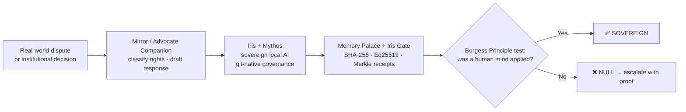

# When the computer says no, I build the answer.

> **A unified sovereignty stack — doctrine, cryptography, sovereign AI, and accessibility — shipping into real institutional cases. Not a manifesto. A working system.**

---

## The problem — and my answer

Institutions hide behind automation. *“The computer says no”* — without a single human ever looking at the facts.

I’m a disabled builder who got tired of that answer. So I built the **Burgess Principle**: one binary test — **was a human judicial mind applied to the specific facts of this case?** — and the open-source ecosystem to enforce it. Outcomes resolve to **SOVEREIGN** or **NULL**. No middle ground.

---

## 📊 Impact at a glance

| Metric | Reality |
| --- | --- |
| 🌍 **World first** | **OpenHear** — the first fully sovereign, local-first audio pipeline built specifically for hearing aid users *(Phonak Naída M70-SP, Signia Insio 7AX validated)* |
| 💷 **First case fully resolved** | **Wave Utilities — cleared to £0.00** |
| 📬 **Letters stopped** | **TV Licensing** ceased contact once the record was corrected |
| ⚖️ **Article 22 challenges live** | **Amazon** + **Disney+** (UK GDPR, automated decision-making) |
| 🏛️ **Active institutional cases** | Energy Ombudsman ×2 · Local Government Ombudsman · EHRC · Ofgem · Equita ×6 · 7 outstanding FOIs |
| 🚀 **Releases shipped** | **12 releases**, v0.1.0 → **v2.1.0 “The Pattern Completed”** *(24 Apr 2026)* |
| 📚 **Published papers** | **10**, including Paper IX *The Sovereign Pattern* and Paper X *The Restored Keeper* |
| 🤝 **Upstream PRs open** | **OpenClaw #68692** *(73.3k forks)* · **NousResearch #12265** *(99.1k stars)* |
| 🛡️ **Certification mark** | **UK00004343685** *(USPTO filing in progress)* |

---

## 🧱 The stack at a glance

| Layer | What it does |
| --- | --- |
| **Doctrine** | The **Burgess Principle** — one binary test, SOVEREIGN/NULL, certification-marked under **UK00004343685**. |
| **Cryptographic proof** | **Memory Palace** + **Iris Gate** — SHA-256 commitments, Ed25519 signatures, Merkle receipts, selective disclosure, optional post-quantum signing. |
| **Sovereign AI** | **Iris** (voice-first companion) + **Mythos** (doctrinal memory) running locally via Python + llama-cpp + Next.js PWA, governed end-to-end by **git-native governance**. |
| **Hearing sovereignty** | **OpenHear** — local-first audio for hearing aid users, bypassing cloud and proprietary mobile stacks *(Raspberry Pi build planned)*. |
| **Rights & advocacy** | **Mirror** + **Advocate Companion** — classify the situation, map the rights, draft the letter, give one clear next step. |
| **Real cases** | Documented wins, live ombudsman matters, and Article 22 challenges in the [`case-studies`](https://github.com/ljbudgie/burgess-principle/tree/main/case-studies) directory. |

---

## 🛠️ Featured projects

- **[burgess-principle](https://github.com/ljbudgie/burgess-principle)** — The doctrinal anchor and certification-marked standard. **v2.1.0 — The Pattern Completed.**
- **[openhear](https://github.com/ljbudgie/openhear)** — World-first sovereign, local-first audio pipeline for hearing aid users.
- **[Mirror](https://github.com/ljbudgie/Mirror-)** — Local-first rights mapper for administrative justice and human-rights workflows.
- **[advocate-companion](https://github.com/ljbudgie/advocate-companion)** — Disability-aware self-advocacy layer with reasonable adjustments built in.
- **[iris-gate-person](https://github.com/ljbudgie/iris-gate-person)** — Sovereign records and signed-receipt boundary for minimum-necessary disclosure.
- **[burgess-principle / iris](https://github.com/ljbudgie/burgess-principle/tree/main/iris)** — Iris + Mythos: voice-first sovereign AI, governed via signed commits.
- **[nexus-ai-hub](https://github.com/ljbudgie/nexus-ai-hub)** — Experimentation space for agents, memory, and connected sovereign tooling.
- **[case-studies](https://github.com/ljbudgie/burgess-principle/tree/main/case-studies)** — Real-world evidence base: pounds, pence, and paper trails.

---

## ⚙️ How it works

1. **Capture** the facts locally — phone-first, voice-friendly, accessibility-first.
2. **Map** the rights and draft the response with **Mirror** / **Advocate Companion**.
3. **Reason** with **Iris + Mythos** in Sovereign Local Mode — every prompt and policy lives as a signed commit.
4. **Prove it** with **Memory Palace** receipts, then apply the **SOVEREIGN/NULL** test and escalate if the answer is NULL.

> *Suggested: drop a richer Mermaid architecture diagram into [`/docs/architecture.md`](https://github.com/ljbudgie/burgess-principle) and link it here once it’s in.*

---

## 🔥 Recent momentum *(last 30–45 days)*

- **Iris + Mythos under git-native governance** — every prompt, policy, and doctrinal change ships as a signed commit and reviewable PR. The AI layer now has the same audit discipline as the cryptographic stack.
- **OpenHear recognised as a world first** — no comparable open, local-first hearing-aid stack is known to exist. Validated on Phonak Naída M70-SP and Signia Insio 7AX; Raspberry Pi build planned for full iOS bypass.
- **Burgess Principle v2.1.0 — The Pattern Completed** *(24 Apr 2026)* — SOUL.md grounds SOVEREIGN/NULL in Genesis 4 and the restoration on the shore of Galilee, completing the arc of Papers IX and X.
- **Upstream PRs open** — **OpenClaw [#68692](https://github.com/openclaw/openclaw)** *(73.3k forks · publicly endorsed by Elon Musk, 18 Apr 2026)* and **NousResearch [#12265](https://github.com/NousResearch/hermes-agent)** *(99.1k stars)*. ZeroClaw *(30.3k stars)* cascades governance if #68692 merges.
- **Article 22 UK GDPR challenges live** — formal challenges sent to **Amazon** and **Disney+** *(18 Apr 2026)* on automated decision-making in paid subscriptions.
- **xAI / Terafab correspondence** — proposing the Burgess Principle as the governance layer for X API access.
- **USPTO filing** — US trademark attorney engaged for parallel certification mark alongside **UK00004343685**.
- **Active institutional cases** — Energy Ombudsman ×2 · LGO · EHRC · Ofgem · Equita ×6 · 7 outstanding FOIs.

---

## 🚪 Get started — join the movement

- 🧠 **Try Iris** in [Sovereign Local Mode](https://github.com/ljbudgie/burgess-principle/blob/main/SOVEREIGN_MODE.md).
- 📂 **Read the [case studies](https://github.com/ljbudgie/burgess-principle/tree/main/case-studies)** — see what SOVEREIGN/NULL looks like in pounds and pence.
- 🛠️ **Explore the tools** — [Mirror](https://github.com/ljbudgie/Mirror-) · [OpenHear](https://github.com/ljbudgie/openhear) · [Advocate Companion](https://github.com/ljbudgie/advocate-companion) · [Iris Gate](https://github.com/ljbudgie/iris-gate-person).
- 🤝 **Contribute** if you care about **data sovereignty, accountable AI, local-first software, accessibility-first design, or human-review standards**.
- ⭐ **Star [burgess-principle](https://github.com/ljbudgie/burgess-principle)** to follow the doctrinal releases.

> 📌 **Recommended pinned repos:** `burgess-principle` · `openhear` · `Mirror-` · `advocate-companion` · `nexus-ai-hub` · `iris-gate-person`.

---

Open-source projects are **MIT-licensed**. The Burgess Principle certification mark is separately governed under **UK00004343685**, with a parallel **USPTO certification mark filing** in progress. *Last updated: 3 May 2026.*
