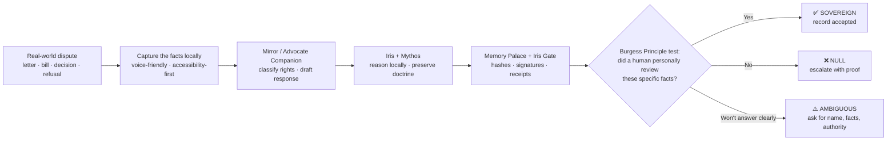

# When the computer says no, I build the answer.

> **A unified sovereignty stack — doctrine, governance, cryptographic proof, sovereign AI, certification pathways, and accessibility — shipping into real institutional cases. Not a manifesto. A working system.**

---

## About

I'm a disabled builder shipping an open-source **sovereignty stack** that turns real-world institutional disputes into signed, verifiable records. The stack combines a certification-marked doctrine (the **Burgess Principle**), local-first cryptographic proof, sovereign AI that runs on your own machine, governance and certification routes, and accessibility-first tooling — including the world's first sovereign, local-first audio pipeline for hearing aid users.

Everything here is in active use on real cases: ombudsman matters, UK GDPR / DUAA 2025 automated-decision challenges, certification readiness work, and disputes that have already resolved to **£0.00**.

**Keywords:** sovereign AI · local-first · UK GDPR Article 22 · administrative justice · accessibility · hearing-aid audio · cryptographic receipts · disability rights

## Contents

- [The problem — and my answer](#the-problem--and-my-answer)
- [📊 Impact at a glance](#-impact-at-a-glance)
- [🧱 The stack at a glance](#-the-stack-at-a-glance)
- [🛠️ Featured projects](#️-featured-projects)
- [⚙️ How it works](#️-how-it-works)
- [🔥 Recent momentum](#-recent-momentum-mayjuly-2026)
- [🏛️ Governance and certification](#️-governance-and-certification)
- [🚪 Get started — join the movement](#-get-started--join-the-movement)

---

## The problem — and my answer

Institutions hide behind automation. *"The computer says no"* — without a single human ever looking at the facts.

I'm a disabled builder who got tired of that answer. So I built the **Burgess Principle**: one operational test — **was a human member of the team able to personally review the specific facts of my specific situation?** — and the open-source ecosystem to enforce it. Outcomes resolve to **SOVEREIGN**, **NULL**, or **AMBIGUOUS** when an institution hides behind process language instead of answering directly.

---

## 📊 Impact at a glance

| Metric | Reality |
| --- | --- |
| 🌍 **World first** | **OpenHear** — the first fully sovereign, local-first audio pipeline built specifically for hearing aid users *(Phonak Naída M70-SP, Signia Insio 7AX validated)* |
| 💷 **First case fully resolved** | **Wave Utilities — cleared to £0.00** |
| 📬 **Letters stopped** | **TV Licensing** ceased contact once the record was corrected |
| ⚖️ **Article 22 challenges live** | **Amazon** + **Disney+** (UK GDPR, automated decision-making) |
| 🏆 **First judicial validation** | **TPT DK00003-2605 ALLOWED** — Traffic Penalty Tribunal, 14 June 2026: automated enforcement collapsed when a named adjudicator applied individual scrutiny to the specific facts. Named enforcement officer confirmed PCN cancelled in writing. |
| 🏛️ **Active institutional cases** | **82-entry live audit log** · 11 SOVEREIGN · 71 NULL · Energy Ombudsman / litigation · LGO · EHRC · Ofgem · Equita ×6 · CMA (viagogo) · IOPC · Trading Standards · 20+ live formal proceedings · multiple FOI fronts |
| 🚀 **Releases shipped** | **20 tagged releases**, v0.1.0 → **v2.5.3** · current framework version **v2.6.6** *(27 June 2026)* |
| 📚 **Published papers** | **10 doctrinal** + **6 SSRN academic papers**: *The Burgess Test* (6759778) · *The Accountability Gap* (6864621) · *NULL at Scale* (6894860) · *Differential Ire* (6909118) · *SOVEREIGN Counsel* (6913498) · *The Sovereign Decline* (6915798) |
| 🤝 **Upstream PRs open** | [**OpenClaw #68692**](https://github.com/openclaw/openclaw/pull/68692) *(73.3k forks)* · [**NousResearch #12265**](https://github.com/NousResearch/hermes-agent/pull/12265) *(99.1k stars)* |
| 🌐 **Site live** | [**theburgessprinciple.com**](https://theburgessprinciple.com) · [certify.theburgessprinciple.com](https://certify.theburgessprinciple.com) |
| 🛡️ **Certification mark** | **UK00004343685** · The Burgess Principle Limited **Co. No. 17199287** · [certify.theburgessprinciple.com](https://certify.theburgessprinciple.com) |

---

## 🧱 The stack at a glance

| Layer | What it does |
| --- | --- |
| **Doctrine** | The **Burgess Principle** — one accountable human-review test resolving to **SOVEREIGN / NULL / AMBIGUOUS**, certification-marked under **UK00004343685**. |
| **Governance & certification** | **GOVERNANCE.md**, **CERTIFICATION_TIERS.md**, adoption ledgers, and the hybrid MIT core + controlled certification mark model. |
| **Cryptographic proof** | **Memory Palace** + **Iris Gate** — SHA-256 commitments, Ed25519 signatures, Merkle receipts, selective disclosure, optional post-quantum signing. |
| **Sovereign AI** | **Iris** (voice-first companion) + **Mythos** (doctrinal memory), with hosted Iris, Sovereign Local Mode, federation protocol, and git-native governance. |
| **Hearing sovereignty** | **OpenHear** — local-first audio for hearing aid users, bypassing cloud and proprietary mobile stacks *(Raspberry Pi build planned)*. |
| **Rights & advocacy** | **Mirror** + **Advocate Companion** — classify the situation, map the rights, draft the letter, give one clear next step. |
| **Verifiable Human Oversight** | `verifiable_oversight/` — stdlib-only Python implementation of the binary test: Ed25519 signing, append-only record storage, institutional domains (energy, banking, email, medical, planning), and a deadline engine. |
| **Real cases** | Documented wins, live ombudsman matters, and Article 22 challenges in the `case-studies` directory (linked below). |

---

## 🛠️ Featured projects

| Project | What it is |
| --- | --- |
| [**burgess-principle**](https://github.com/ljbudgie/burgess-principle) | The doctrinal anchor, governance record, templates, schemas, certification routes, and MIT-open core. **v2.6.6 — current.** |
| [**Iris**](https://github.com/ljbudgie/Iris) | Flagship sovereign AI implementation layer and federation protocol, deployed at [iris-gate.vercel.app](https://iris-gate.vercel.app). |
| [**openhear**](https://github.com/ljbudgie/openhear) | World-first sovereign, local-first audio pipeline for hearing aid users. |
| [**Mirror**](https://github.com/ljbudgie/Mirror) | Local encrypted profile store for Mirror Mode, so Iris can reuse preferred names, greetings, and reflection settings without cloud identity storage. |
| [**advocate-companion**](https://github.com/ljbudgie/advocate-companion) | Disability-aware self-advocacy layer with reasonable adjustments built in. |
| [**iris-gate-person**](https://github.com/ljbudgie/iris-gate-person) | Sovereign records and signed-receipt boundary for minimum-necessary disclosure. |
| [**nexus-ai-hub**](https://github.com/ljbudgie/nexus-ai-hub) | Experimentation space for agents, memory, and connected sovereign tooling. |
| [**case-studies**](https://github.com/ljbudgie/burgess-principle/tree/main/case-studies) | Real-world evidence base: pounds, pence, and paper trails. |
| [**certification tiers**](https://github.com/ljbudgie/burgess-principle/blob/main/CERTIFICATION_TIERS.md) | Public repository mirror of certified Practitioner, Technology & Advocacy, and Institutional pathways. |
| [**SSRN academic series**](https://github.com/ljbudgie/burgess-principle/blob/main/papers/SSRN_INDEX.md) | Six-paper series: theory · philosophy · empirical proof · behavioural consequences · legal services · patient-led innovation. |
| [**theburgessprinciple.com**](https://theburgessprinciple.com) | Public site with live CSV-driven institution tables pulled directly from the repository. |

---

## ⚙️ How it works

The stack turns a real-world decision into a clear record, tests whether a human actually reviewed it, and preserves the evidence needed to challenge the outcome.

```mermaid
flowchart LR
    A[Real-world dispute<br/>letter · bill · decision · refusal] --> B[Capture the facts locally<br/>voice-friendly · accessibility-first]
    B --> C[Mirror / Advocate Companion<br/>classify rights · draft response]
    C --> D[Iris + Mythos<br/>reason locally · preserve doctrine]
    D --> E[Memory Palace + Iris Gate<br/>hashes · signatures · receipts]
    E --> F{Burgess Principle test:<br/>did a human personally review<br/>these specific facts?}
    F -->|Yes| G[✅ SOVEREIGN<br/>record accepted]
    F -->|No| H[❌ NULL<br/>escalate with proof]
    F -->|Won't answer clearly| I[⚠️ AMBIGUOUS<br/>ask for name, facts, authority]
```

*Diagram: a real-world dispute is captured locally, classified by Mirror/Advocate Companion, reasoned over by Iris + Mythos, sealed with cryptographic receipts, and then tested against the Burgess Principle — resolving to **SOVEREIGN** (record accepted), **NULL** (escalate with proof), or **AMBIGUOUS** (force a direct answer).*

1. **Capture the record.** Start with the actual facts: the decision, letter, bill, refusal, call note, or screenshot. Keep it local, accessible, and under the person's control.
2. **Classify the issue.** **Mirror** and **Advocate Companion** identify the rights, reasonable adjustments, statutory duties, and next best response.
3. **Reason locally.** **Iris + Mythos** help turn the facts into a clear argument while keeping doctrine, prompts, and policy changes reviewable through signed commits.
4. **Create proof.** **Memory Palace** and **Iris Gate** bind the record with SHA-256 hashes, Ed25519 signatures, Merkle receipts, and minimum-necessary disclosure.
5. **Apply the test.** The Burgess Principle asks one question: **was a human member of the team able to personally review the specific facts of my specific situation?**
6. **Act on the result.** If the answer is **SOVEREIGN**, the record can stand. If the answer is **NULL** or **AMBIGUOUS**, escalate with the signed proof trail and demand named human review.

---

## 🔥 Recent momentum *(May–July 2026)*

- **TPT DK00003-2605 ALLOWED — 14 June 2026** — Traffic Penalty Tribunal: DBC produced no compliant hire agreement and no evidence of a long-term lease with the necessary degree of permanence. Automated enforcement collapsed when a named adjudicator applied individual scrutiny to the specific facts. **First external judicial validation of the Burgess Principle binary test.**
- **British Gas / Dharmesh Rajput — SOVEREIGN (entry #81, 29 June 2026)** — Director of Customer Service responded personally; both accounts confirmed on hold during Ombudsman investigation; named contact appointed. A named human applied individual consideration to the specific facts.
- **Six SSRN academic papers published** — a six-paper series spanning theory *(The Burgess Test, 6759778)*, political philosophy *(The Accountability Gap, 6864621)*, empirical proof *(NULL at Scale, 6894860)*, behavioural accountability *(Differential Ire, 6909118)*, legal services *(SOVEREIGN Counsel, 6913498)*, and patient-led innovation *(The Sovereign Decline, 6915798)*. Papers 3 and 6 DISTRIBUTED; Papers 1 and 2 DISTRIBUTED; Papers 4 and 5 APPROVED.
- **82-entry live audit log** *(as of 2 July 2026)* — 11 SOVEREIGN, 71 NULL — across energy, local government, policing, legal services, platforms, regulators, and parliamentary bodies. Canonical Institution Audit Taxonomy v1.1 published with five-dimension scoring.
- **theburgessprinciple.com live** *(15 June 2026)* — public site with live CSV-driven institution tables pulled directly from the repository; no manual re-upload required when the repo updates.
- **Verifiable Human Oversight module shipped** — stdlib-only Python implementation of the binary test across energy, banking, email, medical, planning, and capacity domains; Ed25519 signing; append-only record storage.
- **v2.5.1 → v2.6.6 released** *(May–June 2026)* — seven releases since Governance & Ecosystem, covering: academic publication, SSRN papers, live ledger, accessibility templates, canonical taxonomy, Framer site, Iris embed mode, NULL Hunter, LEGAL_FOUNDATIONS.md, DISAMBIGUATION.md, model-card, ADM human review standard, DUAA 2025 s.80 analysis, and Verifiable Human Oversight.
- **Certification pathways active** — Practitioner, Technology & Advocacy, and Institutional routes at [certify.theburgessprinciple.com](https://certify.theburgessprinciple.com); founding rates open until 31 July 2026.

> Headline metrics — active cases, world firsts, resolved disputes — live in the [Impact at a glance](#-impact-at-a-glance) table above.

---

## 🏛️ Governance and certification

The repository core stays **MIT-open**: prompts, templates, schemas, mappings, examples, and code can be used, forked, and improved freely under the MIT licence.

Official **Certified Burgess Principle** use is separate. The UK Certification Mark **UK00004343685** is administered through The Burgess Principle Limited to prevent badge-washing and keep certified claims evidence-led, neutral, and reviewable.

| Need | Route |
| --- | --- |
| Use the framework or templates | MIT-open core in [burgess-principle](https://github.com/ljbudgie/burgess-principle) |
| Contribute docs, templates, tests, or integrations | [CONTRIBUTING.md](https://github.com/ljbudgie/burgess-principle/blob/main/CONTRIBUTING.md) + lazy-consensus governance |
| Understand project decision-making | [GOVERNANCE.md](https://github.com/ljbudgie/burgess-principle/blob/main/GOVERNANCE.md) |
| Prepare an organisation for certified adoption | [CERTIFICATION_TIERS.md](https://github.com/ljbudgie/burgess-principle/blob/main/CERTIFICATION_TIERS.md) + [certification site](https://certify.theburgessprinciple.com) |
| Track adoption and cases | [ADOPTION.md](https://github.com/ljbudgie/burgess-principle/blob/main/ADOPTION.md) + [STATUS.md](https://github.com/ljbudgie/burgess-principle/blob/main/STATUS.md) |

---

## 🚪 Get started — join the movement

- 🧠 **Try Iris** at [iris-gate.vercel.app](https://iris-gate.vercel.app) or in [Sovereign Local Mode](https://github.com/ljbudgie/burgess-principle/blob/main/SOVEREIGN_MODE.md).
- 🌐 **Visit [theburgessprinciple.com](https://theburgessprinciple.com)** — live institution audit tables, framework overview, and Iris embed.
- 📂 **Read the [case studies](https://github.com/ljbudgie/burgess-principle/tree/main/case-studies)** — see what SOVEREIGN / NULL / AMBIGUOUS looks like in pounds and pence.
- 📚 **Read the [academic series](https://github.com/ljbudgie/burgess-principle/blob/main/papers/SSRN_INDEX.md)** — six SSRN papers mapping the binary test across law, philosophy, empirical audit, and patient-led innovation.
- 🏛️ **Review [governance](https://github.com/ljbudgie/burgess-principle/blob/main/GOVERNANCE.md)** and the [certification routes](https://github.com/ljbudgie/burgess-principle/blob/main/CERTIFICATION_TIERS.md).
- 🛠️ **Explore the tools** — see the [Featured projects](#️-featured-projects) table above.
- 🤝 **Contribute** if you care about **data sovereignty, accountable AI, local-first software, accessibility-first design, or human-review standards**.
- ⭐ **Star [burgess-principle](https://github.com/ljbudgie/burgess-principle)** to follow the doctrinal releases.

> 📌 **Recommended pinned repos:** `ljbudgie/burgess-principle` · `ljbudgie/Iris` · `ljbudgie/openhear` · `ljbudgie/Mirror` · `ljbudgie/advocate-companion` · `ljbudgie/nexus-ai-hub` · `ljbudgie/iris-gate-person`.

---

Open-source projects are **MIT-licensed**. The Burgess Principle certification mark is separately governed under **UK00004343685** by The Burgess Principle Limited, company number **17199287**, with a parallel **USPTO certification mark filing** in progress.
