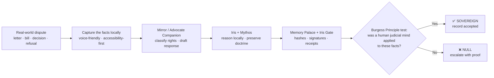

# When the computer says no, I build the answer.

> **A unified sovereignty stack — doctrine, cryptography, sovereign AI, and accessibility — shipping into real institutional cases. Not a manifesto. A working system.**

---

## About

I'm a disabled builder shipping an open-source **sovereignty stack** that turns real-world institutional disputes into signed, verifiable records. The stack combines a certification-marked doctrine (the **Burgess Principle**), local-first cryptographic proof, sovereign AI that runs on your own machine, and accessibility-first tooling — including the world's first sovereign, local-first audio pipeline for hearing aid users.

Everything here is in active use on real cases: ombudsman matters, UK GDPR Article 22 challenges, and disputes that have already resolved to **£0.00**.

**Keywords:** sovereign AI · local-first · UK GDPR Article 22 · administrative justice · accessibility · hearing-aid audio · cryptographic receipts · disability rights

## Contents

- [The problem — and my answer](#the-problem--and-my-answer)
- [📊 Impact at a glance](#-impact-at-a-glance)
- [🧱 The stack at a glance](#-the-stack-at-a-glance)
- [🛠️ Featured projects](#️-featured-projects)
- [⚙️ How it works](#️-how-it-works)
- [🔥 Recent momentum](#-recent-momentum-last-3045-days)
- [🚪 Get started — join the movement](#-get-started--join-the-movement)

---

## The problem — and my answer

Institutions hide behind automation. *"The computer says no"* — without a single human ever looking at the facts.

I'm a disabled builder who got tired of that answer. So I built the **Burgess Principle**: one binary test — **was a human judicial mind applied to the specific facts of this case?** — and the open-source ecosystem to enforce it. Outcomes resolve to **SOVEREIGN** or **NULL**. No middle ground.

---

## 📊 Impact at a glance

| Metric | Reality |
| --- | --- |
| 🌍 **World first** | **OpenHear** — the first fully sovereign, local-first audio pipeline built specifically for hearing aid users *(Phonak Naída M70-SP, Signia Insio 7AX validated)* |
| 💷 **First case fully resolved** | **Wave Utilities — cleared to £0.00** |
| 📬 **Letters stopped** | **TV Licensing** ceased contact once the record was corrected |
| ⚖️ **Article 22 challenges live** | **Amazon** + **Disney+** (UK GDPR, automated decision-making) |
| 🏛️ **Active institutional cases** | Energy Ombudsman ×2 · Local Government Ombudsman · EHRC · Ofgem · Equita ×6 · 7 outstanding FOIs |
| 🚀 **Releases shipped** | **12 releases**, v0.1.0 → **v2.1.0 "The Pattern Completed"** *(24 Apr 2026)* |
| 📚 **Published papers** | **10**, including Paper IX *The Sovereign Pattern* and Paper X *The Restored Keeper* |
| 🤝 **Upstream PRs open** | [**OpenClaw #68692**](https://github.com/openclaw/openclaw/pull/68692) *(73.3k forks)* · [**NousResearch #12265**](https://github.com/NousResearch/hermes-agent/pull/12265) *(99.1k stars)* |
| 🛡️ **Certification mark** | **UK00004343685** *(USPTO filing in progress)* |

---

## 🧱 The stack at a glance

| Layer | What it does |
| --- | --- |
| **Doctrine** | The **Burgess Principle** — one binary test, SOVEREIGN/NULL, certification-marked under **UK00004343685**. |
| **Cryptographic proof** | **Memory Palace** + **Iris Gate** — SHA-256 commitments, Ed25519 signatures, Merkle receipts, selective disclosure, optional post-quantum signing. |
| **Sovereign AI** | **Iris** (voice-first companion) + **Mythos** (doctrinal memory) running locally via Python + llama-cpp + Next.js PWA, governed end-to-end by **git-native governance**. |
| **Hearing sovereignty** | **OpenHear** — local-first audio for hearing aid users, bypassing cloud and proprietary mobile stacks *(Raspberry Pi build planned)*. |
| **Rights & advocacy** | **Mirror** + **Advocate Companion** — classify the situation, map the rights, draft the letter, give one clear next step. |
| **Real cases** | Documented wins, live ombudsman matters, and Article 22 challenges in the `case-studies` directory (linked below). |

---

## 🛠️ Featured projects

| Project | What it is |
| --- | --- |
| [**burgess-principle**](https://github.com/ljbudgie/burgess-principle) | The doctrinal anchor and certification-marked standard. **v2.1.0 — The Pattern Completed.** |
| [**openhear**](https://github.com/ljbudgie/openhear) | World-first sovereign, local-first audio pipeline for hearing aid users. |
| [**Mirror**](https://github.com/ljbudgie/Mirror-) [^mirror] | Local-first rights mapper for administrative justice and human-rights workflows. |
| [**advocate-companion**](https://github.com/ljbudgie/advocate-companion) | Disability-aware self-advocacy layer with reasonable adjustments built in. |
| [**iris-gate-person**](https://github.com/ljbudgie/iris-gate-person) | Sovereign records and signed-receipt boundary for minimum-necessary disclosure. |
| [**iris** (in burgess-principle)](https://github.com/ljbudgie/burgess-principle/tree/main/iris) | Iris + Mythos: voice-first sovereign AI, governed via signed commits. |
| [**nexus-ai-hub**](https://github.com/ljbudgie/nexus-ai-hub) | Experimentation space for agents, memory, and connected sovereign tooling. |
| [**case-studies**](https://github.com/ljbudgie/burgess-principle/tree/main/case-studies) | Real-world evidence base: pounds, pence, and paper trails. |

[^mirror]: The repository slug is `Mirror-` (with a trailing dash); the project is referred to as **Mirror** in prose.

---

## ⚙️ How it works

The stack turns a real-world decision into a clear record, tests whether a human actually reviewed it, and preserves the evidence needed to challenge the outcome.

```mermaid
flowchart LR
    A[Real-world dispute<br/>letter · bill · decision · refusal] --> B[Capture the facts locally<br/>voice-friendly · accessibility-first]
    B --> C[Mirror / Advocate Companion<br/>classify rights · draft response]
    C --> D[Iris + Mythos<br/>reason locally · preserve doctrine]
    D --> E[Memory Palace + Iris Gate<br/>hashes · signatures · receipts]
    E --> F{Burgess Principle test:<br/>was a human judicial mind applied<br/>to these facts?}
    F -->|Yes| G[✅ SOVEREIGN<br/>record accepted]
    F -->|No| H[❌ NULL<br/>escalate with proof]
```

*Diagram: a real-world dispute is captured locally, classified by Mirror/Advocate Companion, reasoned over by Iris + Mythos, sealed with cryptographic receipts, and then tested against the Burgess Principle — resolving to **SOVEREIGN** (record accepted) or **NULL** (escalate with proof).*

1. **Capture the record.** Start with the actual facts: the decision, letter, bill, refusal, call note, or screenshot. Keep it local, accessible, and under the person's control.
2. **Classify the issue.** **Mirror** and **Advocate Companion** identify the rights, reasonable adjustments, statutory duties, and next best response.
3. **Reason locally.** **Iris + Mythos** help turn the facts into a clear argument while keeping doctrine, prompts, and policy changes reviewable through signed commits.
4. **Create proof.** **Memory Palace** and **Iris Gate** bind the record with SHA-256 hashes, Ed25519 signatures, Merkle receipts, and minimum-necessary disclosure.
5. **Apply the test.** The Burgess Principle asks one question: **was a human judicial mind applied to the specific facts of this case?**
6. **Act on the result.** If the answer is **SOVEREIGN**, the record can stand. If the answer is **NULL**, escalate with the signed proof trail.

---

## 🔥 Recent momentum *(last 30–45 days)*

- **Iris + Mythos under git-native governance** — every prompt, policy, and doctrinal change now ships as a signed commit and reviewable PR. The AI layer has the same audit discipline as the cryptographic stack.
- **Burgess Principle v2.1.0 — "The Pattern Completed"** *(24 Apr 2026)* — `SOUL.md` grounds SOVEREIGN/NULL in Genesis 4 and the restoration on the shore of Galilee, completing the arc of Papers IX and X.
- **OpenClaw [#68692](https://github.com/openclaw/openclaw/pull/68692)** publicly endorsed by Elon Musk *(18 Apr 2026)*; ZeroClaw *(30.3k stars)* cascades governance if the PR merges.
- **xAI / Terafab correspondence** — proposing the Burgess Principle as the governance layer for X API access.
- **USPTO filing in motion** — US trademark attorney engaged for a parallel certification mark alongside **UK00004343685**.

> Headline metrics — active cases, world firsts, resolved disputes — live in the [Impact at a glance](#-impact-at-a-glance) table above.

---

## 🚪 Get started — join the movement

- 🧠 **Try Iris** in [Sovereign Local Mode](https://github.com/ljbudgie/burgess-principle/blob/main/SOVEREIGN_MODE.md).
- 📂 **Read the [case studies](https://github.com/ljbudgie/burgess-principle/tree/main/case-studies)** — see what SOVEREIGN/NULL looks like in pounds and pence.
- 🛠️ **Explore the tools** — see the [Featured projects](#️-featured-projects) table above.
- 🤝 **Contribute** if you care about **data sovereignty, accountable AI, local-first software, accessibility-first design, or human-review standards**.
- ⭐ **Star [burgess-principle](https://github.com/ljbudgie/burgess-principle)** to follow the doctrinal releases.

> 📌 **Recommended pinned repos:** `burgess-principle` · `openhear` · `Mirror-` · `advocate-companion` · `nexus-ai-hub` · `iris-gate-person`.

---

Open-source projects are **MIT-licensed**. The Burgess Principle certification mark is separately governed under **UK00004343685**, with a parallel **USPTO certification mark filing** in progress.
